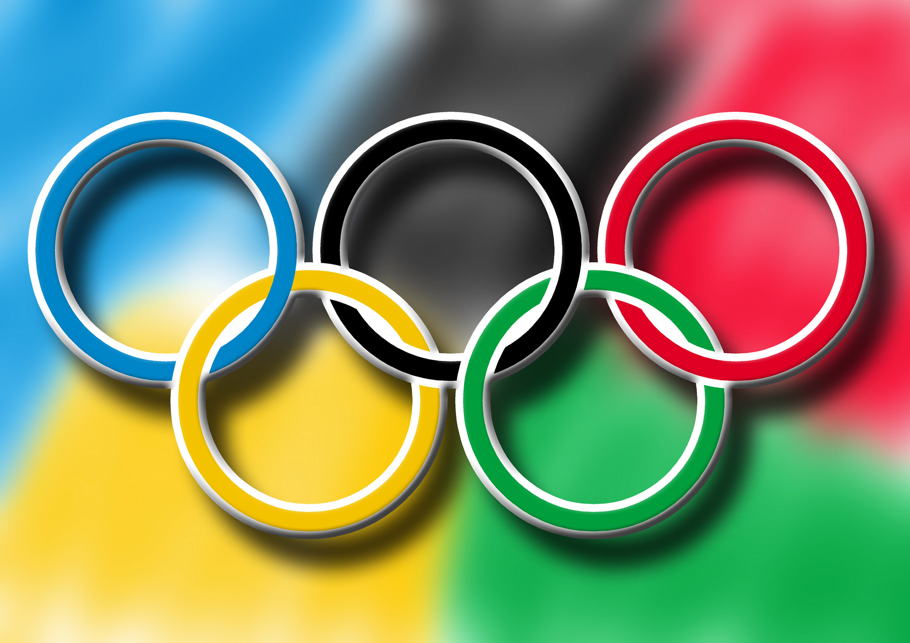
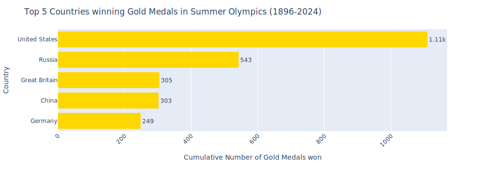
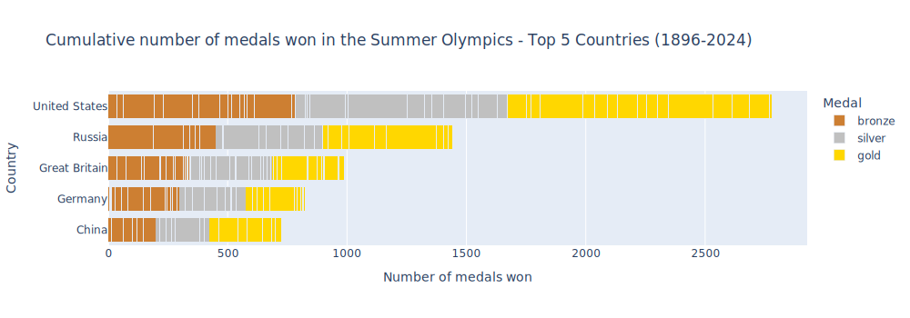
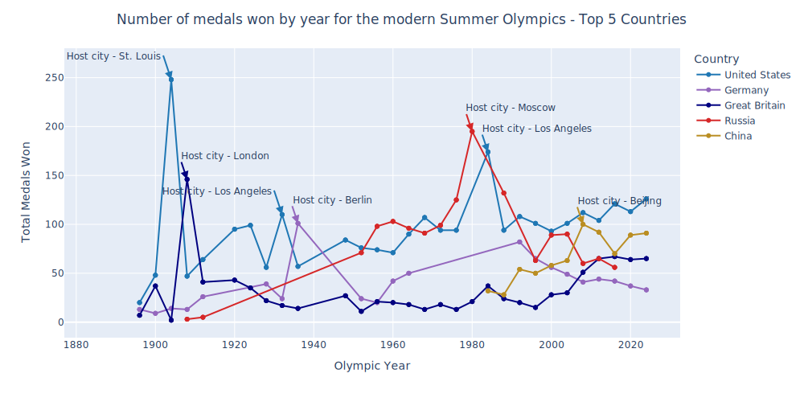
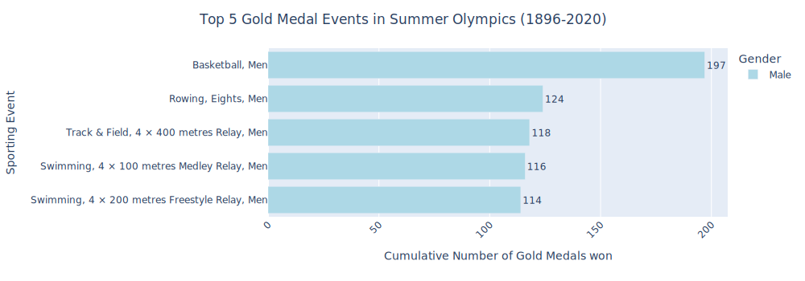
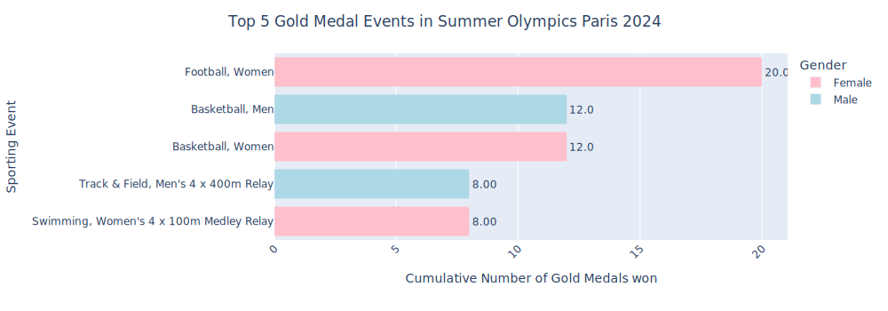
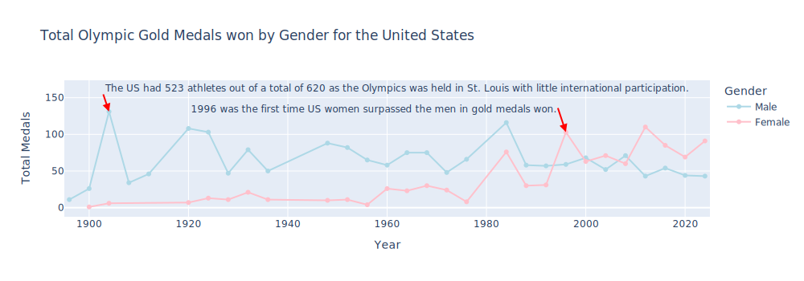
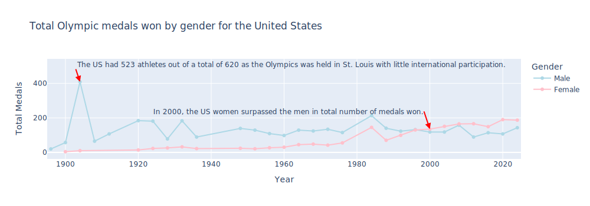
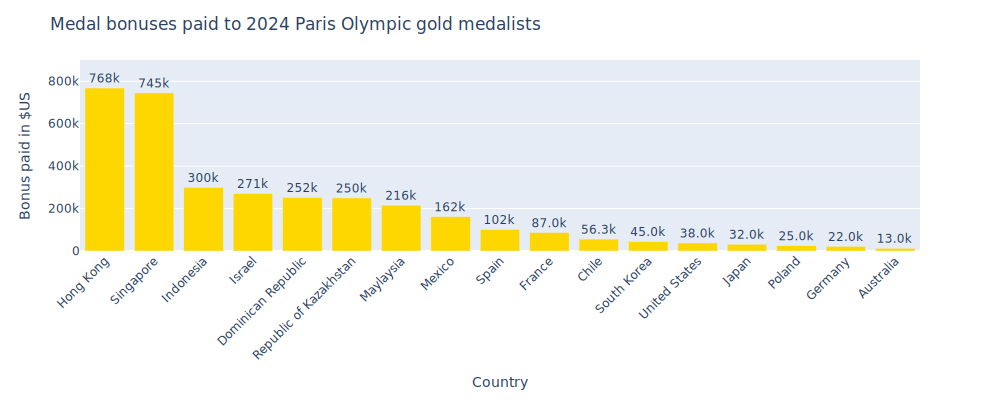

# Using data to investigate the United States dominance in the modern Summer Olympics

The 2024 Paris Olympics have come and gone, but not without reigniting a sense of excitement within me to watch as Olympic content as possible.  These Olympic games brought back a sense of nostalgia for me.  As a kid, I just couldn't wait to see all the sports that brought me so much pride in my country.  My favorites back then included Gymnastics, Diving, Swimming and Track & Field.

This year, I added a few more sports to that original must-see list from my childhood.  The sports in question: Women's Basketball and Breaking.  As it relates to the former, the United States is having a bit of a renaissance with Women's sports. Let's call it, the Caitlyn Clark effect for Women's Basketball & the WNBA.  This translated to a new found love of the game for me and I didn't miss a single moment of the United State's Womens team on their road to Gold.  The latter, was because of all the hype around the somewhat unconventional performances of Australian B-Girl Raygun.

These were my initial thoughts after watching hours and hours of the 2024 Olympic games:
- The United States out-paced all other countries in total medals won, 126 overall and 40 gold
- China placed second with 91 overall medals,  tying the US with 40 gold medals
- The US women seemed to be besting their male counterparts in bringing home medals

There were three themes I wanted to investiage:
- Who wins the most medals? Has the United States always dominated the Summer games, with China being a distant second?
- How much did the US women, contribute to the United States medal tally?
- Is being an Olympian a lucrative career?

I decided to dig into the data of the Olympics to find out.  These are the results from my Olympic investigations.

---
# Data 

I selected 2 datasets from kaggle.  The first contains the historical medal counts and event details from 1896 - 2022.  It was published by Joseph Cheng the url is:  <https://www.kaggle.com/datasets/josephcheng123456/olympic-historical-dataset-from-olympediaorg/data>

I utilized the following raw - files for this analysis:
Olympic_Athlete_Bio.csv (contains athleteID, name, gender, date of birth,  height, weight, country, country code, etc. for Olympic Atheletes)
Olympic_Athlete_Event_Results.csv( contains Olympic edition, edition_id, country code, sporting event, the event category, athlete name, athlete_id, position rank,  medal)

The second dataset contains the medal counts and athlete information for the 2024 Paris Olympics.  It was published by Petro and the url is: <https://www.kaggle.com/datasets/piterfm/paris-2024-olympic-summer-games/data>

I utilized the following raw files for this analysis:
athletes.csv (athlete code, name_TV, country, height, weight)
medalists.csv (medal_date, medal_type, gender, country code, country, nationality, team, team_gender, discipline, event, event type, birth_date, athlete code)

Lastly, based on information gathered from an article from Hola!, I was able to compile some data on Olympic medal bonuses paid to some athletes.  The url for the article is: <https://www.hola.com/us/entertainment/20240731710268/medal-bonuses-at-the-2024-paris-olympics-how-much-countries-will-pay-their-victorious-athletes/>

---
# Data Cleaning
[Data Cleaning Notebook](notebooks/Olympics_data_cleaning.ipynb)

I could not locate any datasets that contained all of the Olympic results in the modern era from 1896 through the 2024 Summer Games.  Therefore, I had to use one data set that contained the history through 2020 and a separate dataset for the 2024 Summer games.  

Essentially I performed the following tasks:
- aligned the columns and column names between the multiple datasets
- concatenated the historical data with the 2024 data, creating 2 new datasets for the modern era (medal tallys by country and medals won by individual athletes)
- ensured consistency between the country names (China vs People's Republic of China for example)
- the historical set was missing some year's results for China and Russia; therefore their tallys are likely to be understated in this investigation
-filtered the historical data set to contain records only pertaining to the Summer Games

If you would like to see a more detailed look into the data cleaning process, you can access it by clicking on the link above to the entire Data Cleaning Notebook.

---

# Questions Asked:
[EDA Notebook](notebooks/Summer_olympics_visualizations.ipynb)

## Which countries win the most Gold medals?

At the 2024 Paris Summer games, the United States and China were numerically tied with 40 gold medals each.  The International Olympic Community breaks ties, such as this one, based on the overall medal tally.  Therefore the United States still gets to claim the top spot for gold medals won.  Does this hold true for the whole of the modern Olympic games?  Indeed it does.

 The United States doesn't only dominate in gold medal wins, they are the top country for all medals.  China, second overall in medals at the 2024 Olympics is in 4th place in gold medals and 5th place in all medals won.   

 

 So far, I've really only viewed the cumulative totals of medals won.  Next up, I decided to see how the United States and China did over time.  

 
 
Now we can clearly see that China surged to 2nd place in medal wins during the 2008 Olympics in Beijing, leading me to another interesting trend.  It would appear that the country hosting the Olympics are highly likely to see a spike in the number of medals won.  This is rather pronounced for the 1904 Olympics in St. Louis. Roughly 15 nations participated, due to the Russo-Japanese war; which made international travel very difficult and expensive.

## In the United States, which gender contributes more to the medal count?  

I began my quest to rate gender performance by aggregating the gold medals by event and gender for the past Olympic Games (1896-2020).  Historically speaking the United States men have contributed quite a bit to our medal tallys.  Compared to the 2024 Paris Summer Olympic games however, shows a shift towards the women's sporting events contributing more to gold medal wins.

This of course lead me to my next Olympic quest for knowledge.  Was the women's performance in 2024 a one time thing?  I decided to look at the gold medal wins by gender over time for the United States.  In 1996, the US women surpassed their male counterparts for the first time; and they have bested their male counterparts in gold medals since the 2012 Summer Games in London.

While the men hold the advantage based on the cumulative history of gold medal wins for the United States, the women have begun a new trend of outperforming their male counterparts.  The same trend can be seen with total medals won.

## How lucrative is it to win Olympic medals?

As the Olympic Committee doesn't provide any compensation to the final medallists, it is up to the discretion of each of the participating nations to set compensation amounts, if any to the winners.  This also made it relatively difficult to find a dataset containing compensatory information.  

However, Hola! published an article containing a list of some countries that have publicly specified what each medal winner was given as a cash bonus.  Hola! compiled this list from individual national Olympic committees, local reporting and sports associations.  All bonuses have been converted to US dollars. 

The biggest surprise is that this is one Olympic list that the United States does not rank in the number 1 spot.  

## Conclusion

There we have it.  The United States has been a dominant force throughout the modern era of the Olympic Summer games.  Since hosting the 2008 games in Beijing, China appears to have become the biggest competition to the United States.  We can also see that the United States women are contributing to the United States dominance in medals, in a big way since surpassing the US men in 2000 for medals won.  Lastly, there is money to be made for winning a gold medal.  However, Hong Kong and Singapore are the leaders in this category, not the United States.